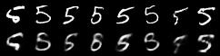

# Out-of-distribution-detection-VAE-Pytorch
This repository is for out-of-distribution detection using VAE  

# VAE features in out-of-distribution detection
VAE maximizes the objective function (ELBO) during training.  

At this time, the ELBO is calculated lower for data not used for training than for data used for training data.   
As shown in the image below.（Blue line is the data used for training・Red line is data not used for training）
<div>
	
</div>
Also, for the reconstructed images, the data used for training are reconstructed well, while the data not used for training are not reconstructed.  
This is an image reconstructed on the training data.
<div></div>
This is an image reconstructed on data not used for training.
<div></div>
  
  
This repository uses this feature to detect out-of-distribution.  

# How to run
In the local environment, the following command can be used to execute it.
```
$ python3 main.py
```
It is easier to run "main.ipynb" with Google Colaboratory → [main.ipynb](https://colab.research.google.com/github/is0383kk/AnomalyDetection_VAE/blob/master/main.ipynb)

# Evaluation of out-of-distribution detection
The results of out-of-distribution detection are evaluated by ROC curve and AUC.  
  
The result of a successful out-of-distribution detection is as follows.（The AUC in this case is 0.8）

<div></div>

- In case of good results
    - ROC curve leans to the upper left
    - AUC is higher
  
On the other hand, the results of poor out-of-distribution detection are as follows.（The AUC in this case is 0.04））

<div></div>

- In case of bad result
    - ROC curve is shifted to the lower right
    - AUC is lower
  


